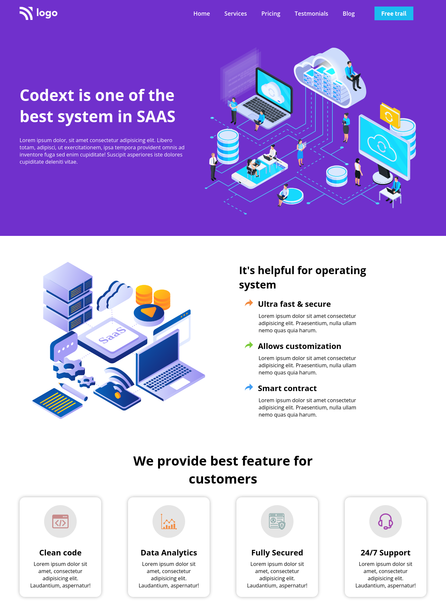

# This is a SAAS Company landing page

Made by **Aditya Kadali**

## Screenshots:

## Built with:

- Semantic HTML5 tags
- CSS Classes
- Custom CSS Utility Classes
- Flexbox layout

## Key learnings:

- Learned to handle Classes most effectively.
- Learned to write CSS utility classes

## Time taken:

- This project took me 2.5hrs to build from scratch

## Links:

- [Live Demo](https://sas-landingpage.netlify.app/)
- [Source Code](https://github.com/Adityakadali/SAAS-Landingpage)
